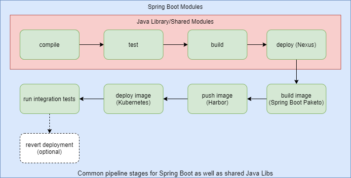
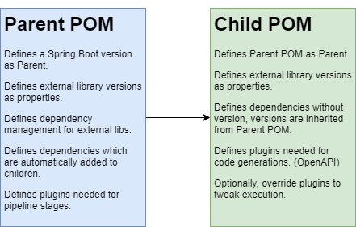
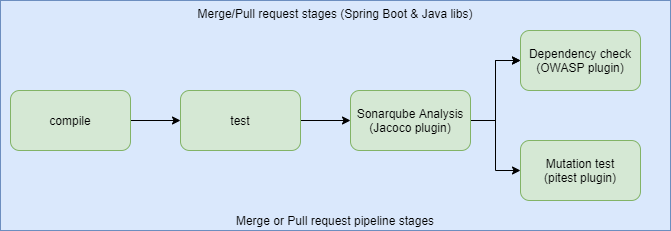
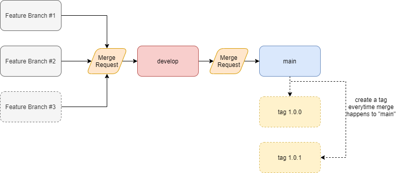
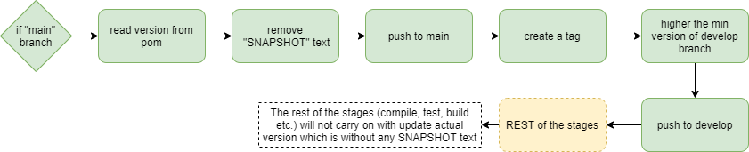
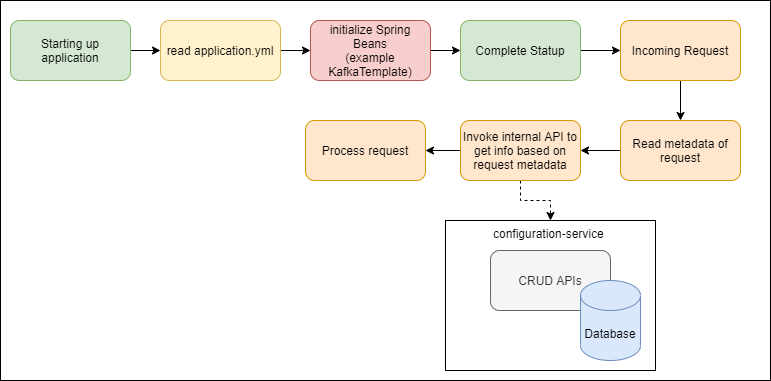
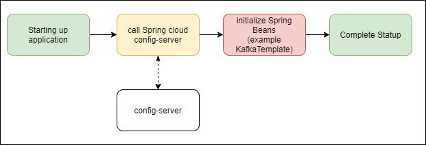
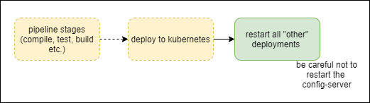
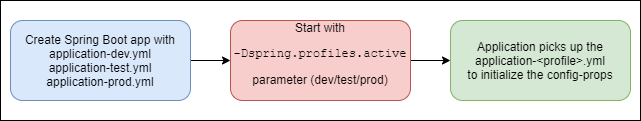

# Organizing your Java/Spring Boot backend

### Contents
1. [Background](#background)
2. [Pipeline](#pipeline)
    1. [Parent POM](#parent-pom)
    2. [Quality-Control on Merge](#quality-control-on-merge)
    3. [Branching strategy and automatic versioning](#branching-strategy-and-automatic-versioning)
3. [Configuration Management](#configuration-management)
4. [APIs - generation & sharing/consumption](#apis---generation--sharingconsumption)
5. [Automated System Integration Tests and Reports](#automated-system-integration-tests-and-reports)
6. [Additional Useful Content](#additional-useful-content)
    1. [Kafka Schema Definition](#kafka-schema-definition)
    2. [Renovate Bot to Automate Dependency Updates](#renovate-bot-to-automate-dependency-updates)

### Background


Consider, a Java application, comprise of several microservices and modules, and in the heart of the application, there is a Message Broker. This article talks about how you can organize this backend code and be tied together with a common pipeline, with clean release and branching strategies.


> TODO: put an architecture diagram here


### Pipeline


The very first thing we invested time on was building a common pipeline for all our Java code, be it a shared library or a Spring Boot application.
But being used for repos which are only supposed to go to an artifact store(Nexus) and also for the repos which needs to be deployed on K8s, came with challenges. It needed to be quite configurable and smart. And it took almost a year to get that piece of code matured. But the major advantage, IMO, it gave us is, streamlining branching and release strategy.
Our common pipeline stages were these:





#### Parent POM


To achieve the above construction, we needed to have quite a lot of things common in our POM, for example, the version of Java, the version of Spring Boot, and the plugins we used to execute some of the stages in our pipeline. Here, actually, you have 2 choices, make maven templates to generate the skeleton of every project, then your POM always has the required things needed by default, and create a Parent POM, from where every Java and Spring Boot project builds their own POM and if required overwrite plugins and other properties.
We choose the Parent POM way. There we defined versions as properties, defined dependency management, and plugins needed to test, generate reports, build images, and do quality control stages.





#### Quality-Control on Merge


When we slowly stabilized our dev-build-release-deploy pipeline, we realized for dev environments, we wanted faster builds and deployment, as we work on feature branches, we wanted to deploy to run our integration tests, and as quickly as possible revert the deployment to a stable branch. But we also wanted to run some quality checks on the code we are creating. Unfortunately, the steps we choose to QA our code, are all very time-consuming and ideally only matter if we are ready to merge to a higher branch.
So, we further configured the pipeline stages to be a bit different on a Merge request (pull request in Github). To make the normal builds faster for developers and assure/force quality standards only if someone is trying to publish/release their changes to higher environments.





#### Branching strategy and automatic versioning


That’s not all, we baked the versioning of the artifacts also into the pipeline. Before I explain that, let me give you an overview of our branching strategy a bit.





For us, a release meant merging to the main branch, where we wanted the pipeline to update the version in the pom, create a tag from that version, and update the snapshot version of develop branch. All this automatically, and we can keep on doing things we love, CODING 😊





This was something we struggled with, the commands to do this seamlessly. But the following are the commands we used in our pipeline code.


````yaml
.increment-versions:
  image: ${MAVEN_IMAGE}
  script:
    - git config --global user.email $GITLAB_USER_EMAIL
    - git config --global user.name $GITLAB_USER_NAME

    # Set the version on the main branch correctly.
    - git checkout $MAIN_BRANCH
    - git reset --hard HEAD
    - git pull https://token:$CI_ACCESS_TOKEN@$CI_SERVER_HOST/$CI_PROJECT_PATH.git $MAIN_BRANCH --rebase
    - git rev-parse HEAD
    - echo "Removing SNAPSHOT from version..."
    - mvn $MAVEN_CLI_OPTS versions:set -DremoveSnapshot
    - POM_VERSION=$(mvn $MAVEN_CLI_OPTS help:evaluate -Dexpression=project.version -q -DforceStdout)
    - git commit -am "Release for version $POM_VERSION"
    - git tag -m "Release version $POM_VERSION" $POM_VERSION

    # Increment the development version.
    - git fetch --all
    - git checkout $DEVELOP_BRANCH
    - git reset --hard HEAD
    - git pull https://token:$CI_ACCESS_TOKEN@$CI_SERVER_HOST/$CI_PROJECT_PATH.git $DEVELOP_BRANCH --rebase
    - git merge $MAIN_BRANCH -X theirs -m "[CI PIPELINE] Sync $MAIN_BRANCH and $DEVELOP_BRANCH"
    - mvn $MAVEN_CLI_OPTS --batch-mode release:update-versions -DautoVersionSubmodules=true
    - POM_VERSION=$(mvn $MAVEN_CLI_OPTS help:evaluate -Dexpression=project.version -q -DforceStdout)
    - git commit -am "Increment versions to '$POM_VERSION'"

    # push without initiating pipeline.
    - git push -o ci.skip https://token:$CI_ACCESS_TOKEN@$CI_SERVER_HOST/$CI_PROJECT_PATH.git $MAIN_BRANCH
    - git push -o ci.skip https://token:$CI_ACCESS_TOKEN@$CI_SERVER_HOST/$CI_PROJECT_PATH.git $DEVELOP_BRANCH
    - git push -o ci.skip --tags https://token:$CI_ACCESS_TOKEN@$CI_SERVER_HOST/$CI_PROJECT_PATH.git

    # Make sure to continue the rest of the pipeline on the main branch.
    - git checkout $MAIN_BRANCH
````


Special thanks here for contribution, to [Kevin Pors](https://www.linkedin.com/in/kevin-pors-8398673/)


### Configuration Management


One of the other things we struggled with initially was managing configuration, both functional and technical. Some of these were also environment specific. Working with Spring Boot brings its own challenges as well since by default the beans are singleton and if they are initialized based on configuration properties, any change needs a restart of the application.


We divided the problem in hand into pieces and separated functional, technical, and environment specific configs.

We choose to move most of the functional specs to internal APIs on top of MongoDB and Postgres, keeping the option open for functional administrators to manage these via CRUD options. I must say, we were lucky on this aspect since these properties didn’t contribute to bean creation and fortunately, we didn’t need to restart the application(s) for these.





Spring Cloud Config Server is what we choose for our technical properties, such as API endpoint, Message broker-related props, Database endpoints, Spring Boot-specific props etc. The services/modules will read these props at the time of startup and most of them will be used to instantiate different beans.





Soon, we ran into 2 sorts of problems, the number one being any change needs a restart of the related application(s) and secondly, some of them are environment specific. To solve the first problem, we investigated our Kubernetes construction, we have separate clusters for each domain, and cross-cluster communication is mostly via message broker/event-driven. So we created a config-server for each cluster and added an extra stage in our pipeline to restart the deployments in that cluster once a deployment happens to our config-server.





For the second problem on env-specific props, Spring Boot already has an answer, profile-based deployment. But we implemented the concept in a different way. Normally, you can specify the profile as a property during deployment/startup and the application picks the specific .yml or .properties file accordingly.





But, we kept our applications separated from this, the means no profile has been set during the deployment of the applications, they all contact the config-server at startup and read the properties config-server gives back. We made our config-server to deployed with the profile, so for env A it gets deployment with properties <application>-A.yml/properties and exposes properties related to that profile. This way we centralized the properties and managed the env-related stuff.


> TODO: picture of profile based config-server


### APIs - generation & sharing/consumption


An application nowadays always has one or more REST endpoints, it is one of the best ways to expose information to the outside world or share within the boundary of the application.
We used OpenAPI standards, created API definitions in YAML, and generated code out of it, for server-side as well as clients. This minimized our code a lot and less code mean less maintenance.


> TODO: open api to server side and client interaction diagram


Snippet of maven plugin to generate server-side code


````xml
<plugin>
    <groupId>org.openapitools</groupId>
    <artifactId>openapi-generator-maven-plugin</artifactId>
    <version>${openapi-generator-maven-plugin.version}</version>
    <executions>
        <execution>
            <goals>
                <goal>generate</goal>
            </goals>
            <configuration>
                <inputSpec>
                    ${project.basedir}/src/main/resources/petstore_api.yml
                </inputSpec>
                <generatorName>spring</generatorName>
                <apiPackage>com.company.generated.pestore.controller</apiPackage>
                <modelPackage>com.company.generated.pestore.model</modelPackage>
                <configOptions>
                    <apiDocs>true</apiDocs>
                    <delegatePattern>true</delegatePattern>
                    <interfaceOnly>true</interfaceOnly>
                    <serializableModel>true</serializableModel>
                    <ensureUniqueParams>false</ensureUniqueParams>
                </configOptions>
            </configuration>
        </execution>
    </executions>
</plugin>
````


This is how you can code the server:


````java
@RestController
@SecurityRequirement(name = "bearerAuth")
@Validated
public class UserController implements UserApi {

    private final UserRepository repository;
    // mapstruct mapper to map from DTO to Response entity
    private final UserMapper userMapper;

    @Override
    public ResponseEntity<User> getUser(String userName) {
        var user = repository.findUserByName(userName);
        return user.map(userDto -> new ResponseEntity<>(mapToUser(userDto), HttpStatus.OK)).orElseGet(()
                -> new ResponseEntity<>(HttpStatus.NOT_FOUND));
    }
}
````


Snippet of maven plugin to generate client-side code


````xml
<plugin>
    <groupId>org.openapitools</groupId>
    <artifactId>openapi-generator-maven-plugin</artifactId>
    <version>${openapi-generator-maven-plugin.version}</version>
    <executions>
        <execution>
            <id>pet-store-api</id>
            <goals>
                <goal>generate</goal>
            </goals>
            <configuration>
                <inputSpec>
                    ${project.basedir}/target/generated-sources/openapi/spec/BOOT-INF/classes/petstore_api.yml
                </inputSpec>
                <generatorName>java</generatorName>
                <addCompileSourceRoot>true</addCompileSourceRoot>
                <apiPackage>com.company.generated.pestore.api</apiPackage>
                <modelPackage>com.company.generated.pestore.model.rest</modelPackage>
                <generateApis>true</generateApis>
                <generateModels>true</generateModels>
                <generateModelDocumentation>false</generateModelDocumentation>
                <generateModelTests>false</generateModelTests>
                <generateApiTests>false</generateApiTests>
                <library>feign</library>
                <configOptions>
                    <dateLibrary>java8</dateLibrary>
                    <sourceFolder>swagger</sourceFolder>
                    <interfaceOnly>false</interfaceOnly>
                    <java8>true</java8>
                </configOptions>
            </configuration>
        </execution>
    </executions>
</plugin>
````


This is how you can code the client:


````java
@Service
public class UserApiBean {

    private final com.company.generated.pestore.api.ApiClient userApiClient;

    public User lookupUser(final String userName) {
        var api = userApiClient.buildClient(UserApi.class);
        return api.getUser(userName);
    }
}
````


Soon we ran into an issue of “how to effectively share the API definitions”. The option we considered was, creating the definition in a separate repository, and sharing it with server as well as clients using “git submodules”. If you are not familiar with submodules, this is a very effective way to share static files between git repositories.


>  TODO: git submodule pic


But we choose a different path. We decided to keep the API definitions in the repository where we coded the server. So, any change in the definition is followed by an update in the server-side code and a release to Nexus as a part of our build-release pipeline.
On the client side or where we are consuming the API, we added the release version as a dependency in our pom.xml. Before generating the client-side code, we ran an extra step to “unpack” the dependency. This became quite handy since it enforces the client to use a release version they want and is useful to the other team members reviewing the changes before it gets pushed to higher branches.

Code snippet of unpack


````xml
<plugin>
    <groupId>org.apache.maven.plugins</groupId>
    <artifactId>maven-dependency-plugin</artifactId>
    <version>3.3.0</version>
    <executions>
        <execution>
            <id>unpack-petstore-api</id>
            <phase>clean</phase>
            <goals>
                <goal>unpack</goal>
            </goals>
            <configuration>
                <artifactItems>
                    <artifactItem>
                        <groupId>com.company</groupId>
                        <artifactId>petstore-api</artifactId>
                        <version>${pet-store-api.version}</version>
                        <outputDirectory>${project.basedir}/target/generated-sources/openapi/spec
                        </outputDirectory>
                        <includes>**/petstore_api.yml</includes>
                    </artifactItem>
                </artifactItems>
            </configuration>
        </execution>
    </executions>
</plugin>
````


Special thanks here for the contribution, to [Tijn van den Bergh](https://www.linkedin.com/in/tijn-van-den-bergh-7414b8140/) 


### Automated System Integration Tests and Reports


Automated tests are an integral part of validating that the code we are releasing is not breaking any other downstream modules. But setting this up properly is always quite challenging. We used Gherkin to write the tests and Cucumber with Spring to run and generate reports. To complete the cycle, we also posted the results into our internal Confluence to keep our stakeholders informed about the details of each test and their results (passed or failed).


>  TODO: diagram of automated test


System integration tests are costly, meaning, it requires time to debug and fix any failing test. So, it is very important that you keep the number of tests here as minimal as possible and only “happy flow” and “crucial business flow” scenarios. All the rest of the scenarios should be captured via Unit tests in each module.
We designed a separate pipeline for this, where we make use of a Spring profile-based run coupled with the branch the tests are running.


>  TODO:  diagram of test pipeline


Special Thanks here for the contribution to [Robert Swier](https://www.linkedin.com/in/robert-swier-a09851b/)


### Additional Useful Content


>  TODO:


#### Kafka Schema Definition


>  TODO:


#### Renovate Bot to Automate Dependency Updates


>  TODO: 

